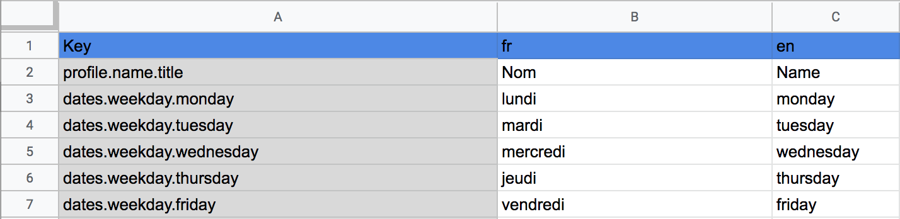
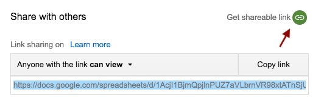

# Flutter Google Sheet localizations generator.

Generates a localizations delegate from an online Google Sheet file.

## Install

Add the following to your `pubspec.yaml`:

```sh
dependencies:
  flutter_sheet_localization: ^1.0.0

dev_dependencies:
  flutter_sheet_localization_generator: ^1.0.0
  build_runner: ^1.3.1
```

### Usage

#### 1. Create a Google Sheet

Create a sheet with your translations (following the bellow format, [an example sheet is available here](https://docs.google.com/spreadsheets/d/1AcjI1BjmQpjlnPUZ7aVLbrnVR98xtATnSjU4CExM9fs/edit#gid=0)) :



Make sure that your sheet is shared :



Extract from the link the `DOCID` and `SHEETID` values : `https://docs.google.com/spreadsheets/d/<DOCID>/edit#gid=<SHEETID>`) :

#### 2. Declare a localization delegate

Declare the following `AppLocalizationsDelegate` class with the `SheetLocalization` annotation pointing to your sheet in a `lib/localization.dart` file :

```dart
import 'package:flutter/widgets.dart';
import 'package:flutter/foundation.dart';
import 'package:flutter_sheet_localization/flutter_sheet_localization.dart';

part 'localizations.g.dart';

@SheetLocalization("DOCID", "SHEETID") // <- See 1. to get DOCID and SHEETID
class AppLocalizationsDelegate extends LocalizationsDelegate<AppLocalizations> {
  const AppLocalizationsDelegate();

  @override
  bool isSupported(Locale locale) =>
      AppLocalizations.languages.containsKey(locale);
  @override
  Future<AppLocalizations> load(Locale locale) =>
      SynchronousFuture<AppLocalizations>(AppLocalizations(locale));
  @override
  bool shouldReload(AppLocalizationsDelegate old) => false;
}
```

#### 3. Generate your localizations

Run the following command to generate a `lib/localization.g.dart` file :

```
flutter packages pub run build_runner build
```

#### 4. Configure your app

Update your Flutter app with your newly created delegate :

```dart
MaterialApp(
    locale: AppLocalizations.languages.keys.first, // <- Current locale
    localizationsDelegates: [
    const AppLocalizationsDelegate(), // <- Your custom delegate
    GlobalMaterialLocalizations.delegate,
    GlobalWidgetsLocalizations.delegate,
    ],
    supportedLocales:
        AppLocalizations.languages.keys.toList(), // <- Supported locales
    // ...
);
```

## Google Sheet format

You can see [an example sheet here](https://docs.google.com/spreadsheets/d/1AcjI1BjmQpjlnPUZ7aVLbrnVR98xtATnSjU4CExM9fs/edit#gid=0).

### Global format

The file should have :

* A first header row
  * Column 0 : "Key"
  * then each supported language code ("en", "fr", ...)
* Following rows for labels
  * Column 0 : the label key (can be a hierarchy, separated by dots)
  * then each translation based on language code of the column

### Dynamic labels

You can insert a `{{KEY}}` template into a translation value to have dynamic labels.

A Dart function will be generated to be used from your code.

```
/// Sheet
values.hello, "Hello {{first_name}}!"

/// Code
print(labels.values.hello(firstName: "World"));
```

## Roadmap / Ideas

* [ ] Conditional values per label (plural, gender, ...)

## Why ?

I find the Flutter internationalization tools not really easy to use, and I wanted a simple tool for sharing translations. Most solutions also use string based keys, and I wanted to generate pure dart code to improve permormance.
